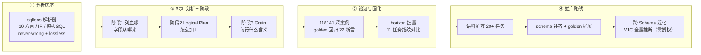
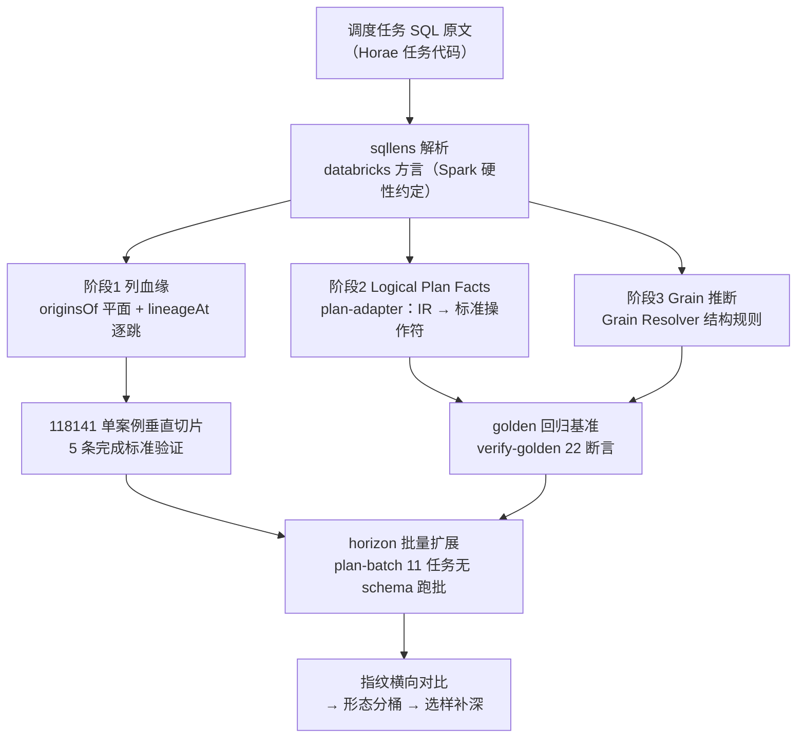
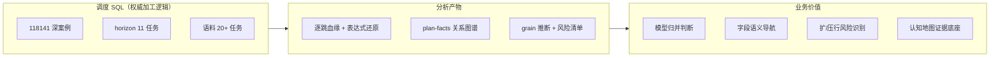
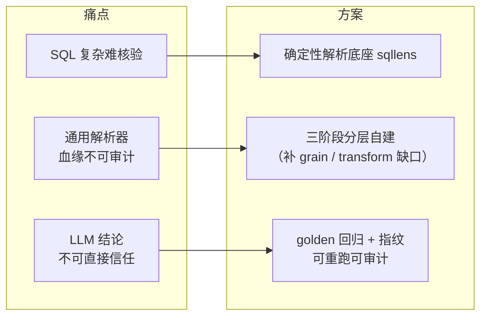
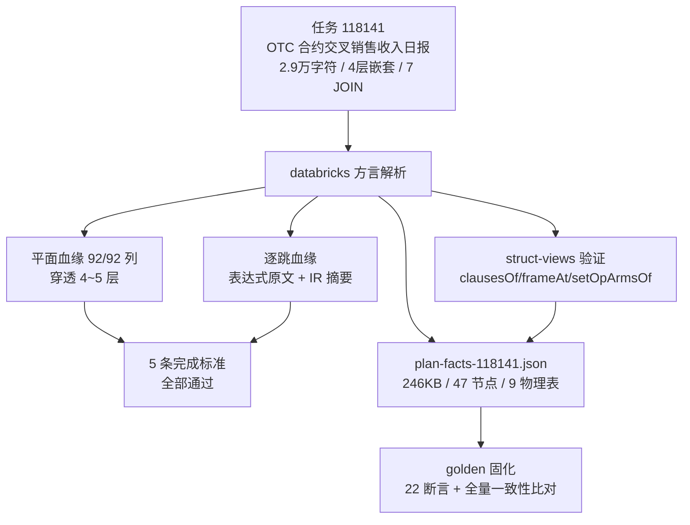
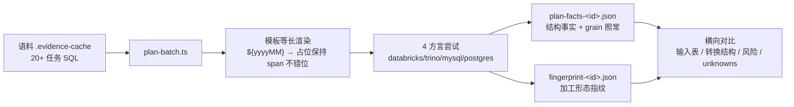
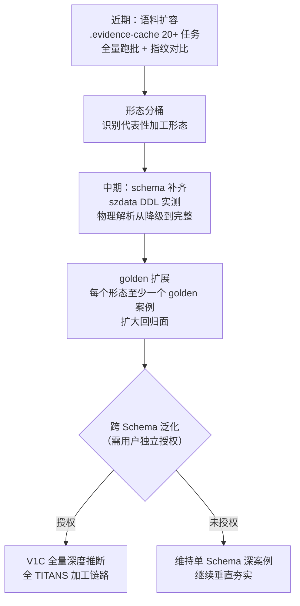

# sqllens 分析能力梳理与调度任务推广汇报

> 汇报对象：sqllens 分析线整体进展
> 编制日期：2026-08-16
> 范围：sqllens 本体、118141 深度案例与 golden 验证、horizon 批量扩展现状、推广路线

---

## 0. 总览

以 sqllens 解析器为底座，按"列血缘 → Logical Plan → Grain"三阶段范式加工调度任务 SQL，先以 118141 单案例完成方法垂直切片验证并固化 golden 基准，再通过批量跑批将范式横向推广到更多调度任务，最终目标是覆盖 TITANS 全部加工链路、支撑业务认知地图。

---

## 1. 技术路径

### 1.1 整体实现路线

**解析底座 → 三阶段分析 → 单案例垂直切片验证 → golden 固化 → 批量横向扩展 → 跨 Schema 泛化**

### 1.2 关键设计决策

| 决策点 | 选择 | 理由 |
|---|---|---|
| 解析器 | sqllens（TypeScript/ANTLR4） | 10 方言、残缺容错、IR 保留完整结构，满足"证据不丢失" |
| Spark SQL 方言 | 一律 databricks | 基于 sqllens 实测验证的硬性约定 |
| 阶段 2 语义 | 对齐 Calcite/Substrait 标准操作符（Read/Filter/Join/Aggregate/Window） | 不自创 Transformation Facts 语义，保持可解释、可对照 |
| 阶段 3 | Grain Resolver 独立成层 | 结构规则 + 可选元数据；无证据时诚实标注 unknown（never-wrong） |
| 验证方式 | golden 回归 + 指纹 | 保证结果可确定性重放、可审计 |

---

## 2. 目的

对 TITANS 全部调度任务 SQL 建立**证据化、可核验、可回归**的加工逻辑认知，回答三个递进问题：

1. **字段从哪来**——每个输出列的来源与计算路径（列血缘）
2. **怎么加工**——JOIN/WHERE/GROUP BY/WINDOW/UNION 等操作结构（Logical Plan）
3. **每行什么含义**——处理后的行粒度、扩行/压行风险（Grain）

最终支撑：字段模型归并判断、语义导航下钻、数据质量风险识别，以及 TITANS 业务认知地图的加工层证据底座。

---

## 3. 原因

### 3.1 为什么需要这条分析线

- **调度任务 SQL 是加工逻辑的唯一权威来源**：字段口径、关联关系、聚合规则全部藏在任务代码里，元数据字典无法替代；
- **SQL 规模与复杂度超出人工核对范围**：118141 单条 SQL 达 2.9 万字符 / 6,847 tokens，4 层嵌套子查询 + lateral view + 窗口函数 + 自定义 UDF + 模板变量；
- **通用解析器能力不足**：sqlglot 等工具无法保证 never-wrong/lossless，血缘结果不可审计；
- **LLM 结论不可直接信任**：TITANS 项目铁律——LLM 输出永远只是候选，必须基于确定性管线 + 物理事实，分析必须可重跑、可回归。

### 3.2 为什么选 sqllens 做底座

- **Never wrong**：无法确定的名称/类型保持 unknown，绝不猜测；
- **Lossless**：保留全部输入信息（token、span、原始拼写），IR 层保留 where/joins/groupBy/joinConditions 完整结构；
- **模板 SQL 原生支持**：jinja 前端（parseTemplated），适配 Horae 的 `${yyyy-MM-dd}` 模板变量；
- **能力边界清晰**：无 transform provenance 与 grain 模型——这正是自建阶段 2/3 的原因，边界已知而非盲区。

---

## 4. 实施方法

### 4.1 底座：sqllens 解析能力

| 能力 | 说明 |
|---|---|
| 方言覆盖 | databricks / tsql / snowflake / bigquery / redshift / postgres / duckdb / trino / sqlite / mysql，语义层方言无关 |
| 结构化视图 API | `clausesOf` / `frameAt` / `nodeAt` / `setOpArmsOf`，直接支撑逻辑执行计划构建 |
| 血缘能力 | 平面血缘 `originsOf` + 逐跳血缘 `lineageAt` |
| 模板 SQL | minijinja 前端，支持 dbt 语义与 Horae 模板变量 |
| 边界 | 无 transform provenance、无 grain 模型；hop 血缘排除 WHERE/JOIN 条件；IR 保留原料 |

### 4.2 三阶段落地

**阶段 1 列血缘**：`originsOf` 平面血缘全覆盖 + `lineageAt` 逐跳血缘穿透 + 5 条完成标准（全列有血缘 / terminal 追到物理字段 / 派生表达式完整保留 / unresolved 显式 unknown / 代表性场景 golden）。

**阶段 2 Logical Plan Facts**：`plan-adapter`（v0.2.0）将 sqllens IR 适配为契约 v1.1.0 的简化计划——47 个关系节点、9 张物理表、标准操作符（read/join/aggregate/window/expand/project），machine truth 不截断，span 可回查 SQL 原文。

**阶段 3 Grain**：`grain_inference` 块随 plan-facts 输出，含 grain_candidate / cardinality / confidence / requires / evidence；expand 采用 fanout 模型（explode 空集合不产生行）。

### 4.3 118141 深度案例验证

**验证结果**：

| 完成标准 | 118141 实测 |
|---|---|
| ① 所有输出列有 lineage | 92/92 列命中，穿透 4~5 层嵌套 |
| ② terminal 追到物理字段 | 逐跳直达输入表物理列；条件列 57/60 物理解析成功 |
| ③ 派生表达式完整保留 | 每跳输出表达式原文（含注释） |
| ④ unresolved 显式 unknown | 3 处 lateral view 盲区显式记录，不猜测 |
| ⑤ 代表性场景 | Union(3分支) / Window / CASE / lateral explode 全覆盖 |

**golden 回归**：`scripts/verification/verify-golden.ts` 22 断言 0 失败，与 `golden/118141/plan-facts.json` 完全一致；重跑命令固化（`npx tsx scripts/plans/plan-118141.ts` + diff 核对）。

### 4.4 horizon 批量扩展

**11 个任务现状**（跑批策略采用无 schema 快速模式：结构事实与 grain 推断照常，物理解析暂降级——szdata 表 DDL 查询能力现成，118141 已实测验证，接入批量管线即补全）：

| 任务形态 | 任务 | 说明 |
|---|---|---|
| 单表 SELECT | 71698 / 146685 / 78477 | 简单读表，0~少量转换 |
| UNION 多表 | 245220 / 71703 / 244357 | 含模板表名、16KB 复杂 UNION |
| INSERT OVERWRITE | 144141 / 62517 / 71734 / 144167 / 160423 | 38~40 列拷贝与加工 |

**指纹内容**：输入表、spine（PROJECT/READ/…）、转换计数（expand/aggregate/window/case/filter/project/union）、known_grains、main_grain 状态、行扩展风险、关键 unknowns——支持跨 SQL 形态分桶与异常识别。

### 4.5 关键踩坑沉淀（重跑依据）

- Spark SQL 一律 databricks 方言；
- 多语句文档必须用 `doc.clausesOf(scope)` 实例方法（自由函数返回空）；
- JOIN 深嵌套必须递归遍历整个 scope 树（118141 的 7 个 JOIN 在最内层）；
- `lineageAt` 偏移必须锚定 `partSpans[0].start`（cell 坐标系），输出 span 需平移；
- `hop.terminal` 失败形态必须严格 `===` 区分 `"unresolved"` 与 `undefined`；
- PowerShell 重定向中文乱码 → 用 `fs.createWriteStream(utf8)` 写文件。

---

## 5. 最终效果

### 5.1 已达成

| 维度 | 成果 |
|---|---|
| 方法验证 | 118141 单案例垂直切片：阶段 1 完成标准 5/5 通过，阶段 2 闭环，阶段 3 原型输出 |
| 回归保障 | golden 回归 22 断言 0 失败，结果可确定性重放 |
| 批量能力 | horizon 11 任务批量跑批 + 指纹对比，无 schema 降级模式可用 |
| 资产沉淀 | 9+ 个可重跑脚本（`sqllens/` 下 real-sql-demo / hop-demo / plan-* / verify-golden）、7 类 118141 产物、总览文档 `docs/sql-analysis-stages.md` |
| 认知边界 | unknowns 全程显式保留：lateral 盲区 3 处、read.columns 恒 null（v2 待覆盖） |

### 5.2 可预期价值

- **模型归并**：列级血缘 + 表达式原文支撑字段口径判断；
- **风险识别**：grain 推断揭示扩行（lateral explode fanout）/ 压行（GROUP BY）风险；
- **可审计交付**：每个结论带方法标识 + 证据 + span 回查，不依赖 LLM 黑盒；
- **规模复制**：指纹 + 形态分桶使新任务可快速定位深分析优先级。

---

## 6. 下一步：分析范式推广路线

### 6.1 路线图

### 6.2 分阶段行动

| 阶段 | 动作 | 出口标准 | 授权要求 |
|---|---|---|---|
| 1. 样本扩容 | 语料 20+ 任务全部跑批，指纹对比分桶 | 加工形态全景图 + 异常任务清单 | 无（现有范围） |
| 2. schema 补齐 | 对分桶代表任务拉取 szdata DDL，补跑物理解析 | 条件列物理解析率提升，unknowns 收敛 | 无（现有范围） |
| 3. golden 扩展 | 每加工形态沉淀一个 golden 案例 + 固定断言 | 回归断言覆盖全部形态 | 无（现有范围） |
| 4. 跨 Schema 泛化 | 在第二个 Schema（Panorama）验证方法有效性 | 方法有效性 / 业务真实性跨 Schema 成立 | **需用户授权**（V1C 当前冻结） |

### 6.3 风险与边界

- **V1C 冻结**：全量深度推断、跨 Schema 扩展、Wiki/LLM 接入均需独立授权（见 `docs/current-status-baseline.md`）；
- **sqllens 已知边界**：lateral 子查询别名列物理解析盲区（followColumn）、read.columns 恒 null 需 qualify 展开 v2；
- **horizon 无 schema 模式**：当前 11 任务的物理解析为降级态，结论仅限结构事实层；
- **单案例约束**：以上全部结论基于 118141，方法有效性、业务真实性、读者可用性均未跨 Schema 验证——推广路线中的每一阶段都以出口标准为门，不静默扩大声明范围。

---

## 附录：产物与脚本索引

| 类别 | 位置 |
|---|---|
| 总览文档 | `docs/sql-analysis-stages.md`（三阶段定义、完成标准、重跑命令） |
| 118141 产物 | `sqllens/output/118141/`（血缘/hops/struct-views/plan-facts/fingerprint） |
| golden 基准 | `sqllens/golden/118141/`（README / plan-facts.json / sql.txt） |
| horizon 批量 | `sqllens/output/horizon/`（11 × fingerprint + plan-facts） |
| 核心脚本 | `sqllens/`：`plan-adapter.ts`（适配器）/ `plan-batch.ts`（批量）/ `plan-fingerprint.ts`（指纹）/ `verify-golden.ts`（回归） |
| 语料 | `.evidence-cache/tasksql-*.txt`（20+ 任务 SQL） |
| 状态基线 | `docs/current-status-baseline.md`（V1C 冻结与授权边界） |
